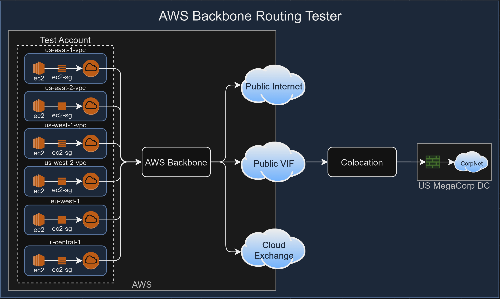

# aws-backbone-routing-tester
- [Overview](#overview)
  - [Key Features](#key-features)
  - [Goals](#goals)
  - [Test Cases](#test-cases)
  - [Project Structure](#project-structure)
  - [Important Notes](#important-notes)
  - [Considerations](#considerations)
  - [Prerequisites](#prerequisites)
  - [Usage](#usage)
  - [TO DO](#to-do)
  - [Contributing](#contributing)
  - [Disclaimer](#disclaimer)
  - [License](#license)


# Overview 

This repository contains Terraform configuration files and various scripts for setting up a test environment to test AWS Internet Gateway and routing.

## Key Features
- Builds consumer ec2, vpc and igw in each region for testing routing and network connectivity across the backbone. 

# Goals
- AWS routes public subnets through public vifs creating connectivity paths from any AWS account to internal corporate networks leveraging public IP space. 
- Test ipv6 routing. 

# Test Cases

| Test Case Description                             | Allowed/Denied                | TestDetail/Result                                |
|---------------------------------------------------|-------------------------------|--------------------------------------------------|
| us-east-1 to public vif destination               | :no_entry_sign:               | Traceroute, icmp and tcp connectivity |
| us-east-2 to public vif destination               | :no_entry_sign:               | Traceroute, icmp and tcp connectivity  |
| us-west-1 to public vif destination               | :no_entry_sign:               | Traceroute, icmp and tcp connectivity |
| us-west-2 to public vif destination               | :no_entry_sign:               | Traceroute, icmp and tcp connectivity |
| tel-aviv to public vif destination                | :no_entry_sign:               | Traceroute, icmp and tcp connectivity |
| eu to public vif destination                      | :no_entry_sign:               | Traceroute, icmp and tcp connectivity |


## Project Structure
```
aws-privatelink-protocol-tester/
├── img/
├── scripts/
│   ├── consumer_ec2.sh    # Consumer startup script
├── ec2.tf                 # Terraform configuration file for defining EC2 instances and related resources.
├── iam.tf                 # Terraform configuration file for defining IAM roles, policies, and profiles.
├── privatelink.tf         # Terraform configuration file for defining AWS PrivateLink endpoints and related resources.
├── README.md              # Markdown file for documenting the project, including descriptions of files and usage.
├── sg.tf                  # Terraform configuration file for defining security groups and their rules.
├── variables.tf           # Terraform configuration file for defining variable declarations.
├── vpc.tf                 # Terraform configuration file for defining VPC, subnets, and related networking resources.
```

## Important Notes


## Considerations
- **DO NOT RUN THIS IN A PRODUCTION ENVIRONMENT**
- Take these results with a grain of salt and do your own thorough testing with your own test cases.
- This is as far as I am in my learning journey, hopefully this helps yours and I appreciate any feedback.

## Prerequisites

1. An AWS account an api keys with access
2. Github account with Github Actions
3. Git installed
4. An ssh/scp client (to login/export results)


## Usage

 - After resources are created, ssh into the consumer ec2 instance via the provided output for the elastic IP. 
 - Once you are logged in run traceroute, netcat and ping commands to various public IPs. 

## TO DO:
 - Automated tester script and output
 - Billing monitoring
    - Automatically pull billing activity during testing to be saved with repo for review later. 


## Contributing

Feel free to submit issues, create pull requests, or fork the repository to help improve the project.

## Disclaimer

This project is for testing and educational purposes only. The author is not responsible for any misuse or damage caused by this tool. Use at your own risk and always test in a safe, non-production environment.

## License

[MIT License](LICENSE)